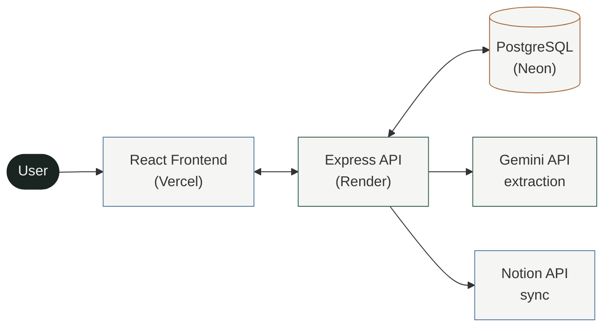
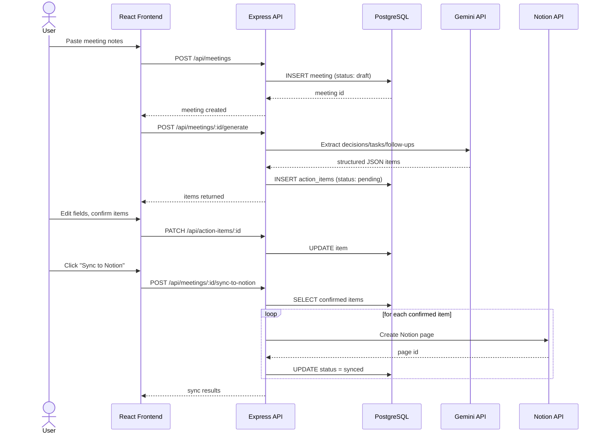
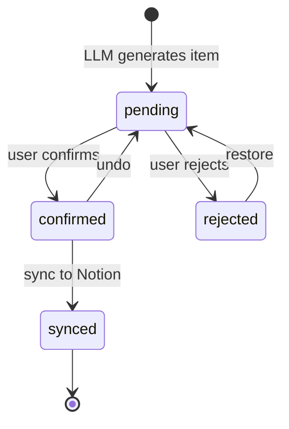

# Meeting → Action

Turn raw meeting notes into structured decisions, tasks, and follow-ups —> reviewed and confirmed by a human before anything gets pushed to a real project-management tool.

**Live demo:** [[meeting-to-action](https://meeting-to-action-three.vercel.app/)]
*(Backend runs on Render's free tier — first request after inactivity can take 30-60s to wake up.)*

**Core idea:** AI drafts, humans decide. Every extracted item stays fully editable, and nothing reaches Notion until a person explicitly confirms it.

---

## System architecture



---

## Request flow (paste notes → sync to Notion)



---


---

## Item review lifecycle

Every generated item moves through an explicit state machine — nothing skips straight from "AI-generated" to "in Notion."



---

## Why this project

Most "AI meeting tool" demos generate a summary and stop — trusting model output blindly, with no review step before it becomes a "task" somewhere. This project treats that gap as the actual engineering problem: the LLM call is the easy part; the state machine, validation, and confirm-before-sync flow are what make it trustworthy enough to actually use.

Built to demonstrate:
- A **human-in-the-loop** workflow, not just "call an API and display the result"
- **Structured LLM extraction** with defensive validation (the model's JSON is never trusted as-is)
- Real **third-party API integration** (Notion) with proper auth and data mapping
- A full **CRUD + review + sync** lifecycle on a normalized Postgres schema

---

## Tech stack

| Layer | Choice |
|---|---|
| Frontend | React (Vite) |
| Backend | Node.js + Express |
| Database | PostgreSQL ([Neon](https://neon.tech)) |
| AI extraction | Google Gemini API |
| PM integration | Notion API |
| Hosting | Render (backend) + Vercel (frontend) |

---

## live demo 


---

## Getting started locally

### 1. Clone and install
```bash
git clone https://github.com/<your-username>/meeting-to-action.git
cd meeting-to-action

cd backend && npm install
cd ../frontend && npm install
```

### 2. Configure environment variables

`backend/.env`:
```
DATABASE_URL=your_neon_connection_string
PORT=4000
GEMINI_API_KEY=your_gemini_key
NOTION_API_KEY=your_notion_integration_secret
NOTION_DATABASE_ID=your_notion_database_id
APP_API_KEY=any_random_string
```

`frontend/.env`:
```
VITE_API_URL=http://localhost:4000
VITE_APP_API_KEY=same_random_string_as_backend
```

### 3. Run the migration
```bash
cd backend && npm run migrate
```

### 4. Start both servers
```bash
# terminal 1
cd backend && npm run dev

# terminal 2
cd frontend && npm run dev
```

Visit `http://localhost:5173`.

---

## Project structure

```
meeting-to-action/
├── backend/
│   ├── src/
│   │   ├── db/          # Postgres pool, migrations, migration runner
│   │   ├── routes/      # meetings + action-items endpoints
│   │   ├── services/    # Gemini extraction, Notion sync
│   │   ├── middleware/ 
│   │   └── server.js
│   └── package.json
├── frontend/
│   ├── src/
│   │   ├── App.jsx       # main UI
│   │   ├── ItemRow.jsx   # editable item card
│   │   ├── api.js        # API client
│   │   └── index.css
│   └── package.json
└── README.md
```

---

## API reference

| Method | Endpoint | Description |
|---|---|---|
| `POST` | `/api/meetings` | Create a meeting from raw notes |
| `GET` | `/api/meetings` | List all meetings |
| `GET` | `/api/meetings/:id` | Get one meeting with its items |
| `POST` | `/api/meetings/:id/generate` | Run LLM extraction on a meeting's notes |
| `PATCH` | `/api/action-items/:id` | Edit a single item |
| `DELETE` | `/api/action-items/:id` | Delete an item |
| `POST` | `/api/meetings/:id/sync-to-notion` | Push confirmed items to Notion |

---

## What I'd improve next

- User accounts (currently single-user, protected by a shared API key)
- Additional PM tool integrations (Trello, Linear) behind the same sync interface
- Retry/backoff handling for LLM rate limits
- Automated tests for the extraction validation logic

---

## Author

**[Manya singh]**
 [yashmiki01@gmail.com]
